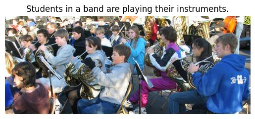

# CLIPxGPT Captioner

## Description

**`CLIPxGPT Captioner`** is Image Captioning Model based on [OpenAI's](https://openai.com/) [CLIP](https://openai.com/blog/clip/) and [GPT-2](https://openai.com/blog/better-language-models/). The Model uses a Mapping module to "translate" CLIP embeddings ​​to GPT-2. The model is trained on the [Flickr30k](https://shannon.cs.illinois.edu/DenotationGraph/) dataset, downloaded from [Kaggle](https://www.kaggle.com/datasets/hsankesara/flickr-image-dataset)

**The goal** of the project was to find out about the possibility of CLIP + GPT-2 connection and to check whether, with a relatively short training time and a small dataset, the model will be able to recognize situations in the pictures. The model achieved satisfactory results.

The training process was carried out using the [Kaggle](https://www.kaggle.com/) P100 GPU.

## Example results




## Usage

Create environment and install requirements:

```bash
python -m venv venv
# for windows
.\venv\Scripts\activate
# for linux/mac
source venv/bin/activate

pip install -r requirements.txt
```

And run prediction:

```bash
python .\src\predict.py -I <image_path> -S <model_size [S/L]> -C <checkpoint_name>
```

### References:

- [OpenAI](https://openai.com/)
- [CLIP](https://openai.com/blog/clip/)
- [GPT-2](https://openai.com/blog/better-language-Models/)
- [ClipCap; Mokady, Ron and Hertz, Amir and Bermano, Amit H](https://arxiv.org/abs/2111.09734)
- [HuggingFace](https://huggingface.co/)
